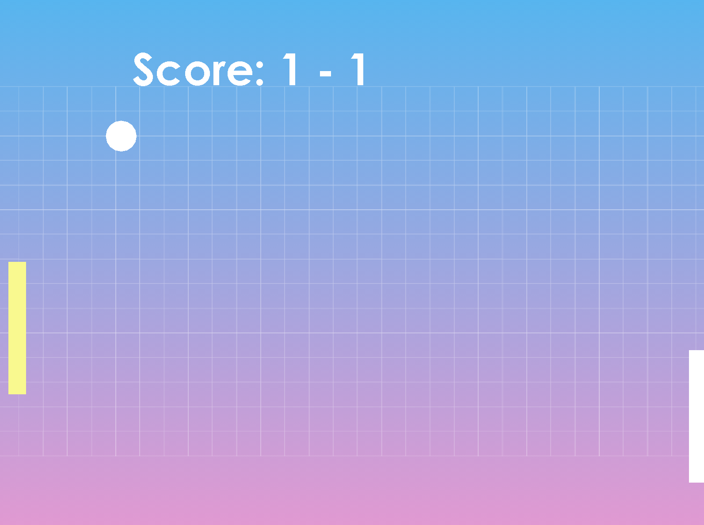

# Galaxy Smash Pong

## The Game

## How to Play

- Press `ENTER` to start the game.
- Player 1 uses `W` to move paddle up and `S` to move paddle down.
- Player 2 uses the `UP` and `DOWN` arrow keys to move paddle.
- Miss the ball and your opponent will gain a point. 
- To secure a victory against your opponent, you must gain five points (minimum) and win by two.
- If you leave your paddle still, you can activate the smash power.

## Dependencies
 - `Java`
 - `Java Swing`
